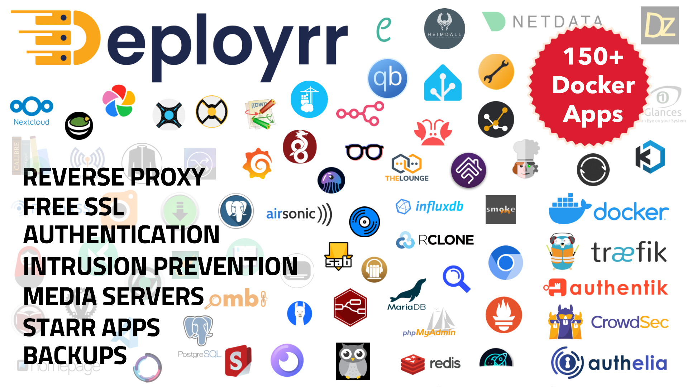

# Deployrr

> Transform your homelab setup from complex to click! Deployrr is your all-in-one solution for automated Docker-based homelab deployment.

[](APPS.md)

## What is Deployrr?

Deployrr revolutionizes homelab setup by automating the deployment and configuration of Docker and Docker Compose environments. Whether you're a homelab enthusiast or a professional sysadmin, Deployrr streamlines the process of setting up and managing your containerized applications.

### Key Features

- **Extensive App Support**: 160+ pre-configured applications ready for deployment
- **Intelligent Automation**: Automated environment setup with smart system checks
- **Enterprise-Grade Security**:
  - Socket-Proxy protection
  - CrowdSec integration
  - Multiple authentication options (Authentik, Authelia, TinyAuth, Google OAuth)
- **Professional Networking**:
  - Advanced Traefik reverse proxy configuration
  - Flexible exposure modes (Internal, External, or Hybrid)
  - Multi-server and multi-domain support
- **AI & Automation Stacks**: Curated app bundles for self-hosted AI (Ollama, Open-WebUI, Flowise) and automation (n8n, Node-RED)
- **Smart Management**:
  - Intuitive stack management interface
  - Automated backup and restoration
  - Comprehensive monitoring and logging
  - Remote share mounting (SMB, NFS, Rclone)

## Prerequisites

First, install Node.js and npm.

**Ubuntu/Debian:**
```bash
curl -fsSL https://deb.nodesource.com/setup_lts.x | sudo -E bash -
sudo apt-get install -y nodejs
```

**Fedora:**
```bash
curl -fsSL https://rpm.nodesource.com/setup_lts.x | sudo -E bash -
sudo dnf install -y nodejs
```

**RHEL/Rocky Linux:**
```bash
curl -fsSL https://rpm.nodesource.com/setup_lts.x | sudo -E bash -
sudo yum install -y nodejs
```

**Arch Linux:**
```bash
sudo pacman -S nodejs npm
```

## Install Deployrr v6

Install Deployrr (same command to update Deployrr):
```bash
sudo npx @simplehomelab/deployrr@latest
```

That is it. You can run Deployrr from anywhere using the command:
```bash
deployrr
```

## Version 5 Support

If your version 5 stopped working, it is probably because you are on a version older than v5.11.2, which is the latest and the last version of Deployrr v5. 

In order to have continued access to version 5 of Deployrr, please manually download v5.11.2 ([v5 branch](https://github.com/SimpleHomelab/Deployrr/tree/v5)) using the following commands:

```
wget https://github.com/SimpleHomelab/Deployrr/raw/refs/heads/v5/deployrr_v5.11.2.app
chmod +x deployrr_v5.11.2.app
./deployrr_v5.11.2.app
```

Use the `deployrr_v5.11.2-arm.app` if you are on ARM architecture. 

## Impact & Growth


## Testimonials

> I went from skeptic to fully believing (and knowing) and its the homelab deal of the century - David S

> With Deployrr I was able to cleanly setup everything in a matter of hours. I'm still new to the platform but so far it's delivered everything I hoped it would - Tim Bishop

[Check Out All Testimonials](https://www.simplehomelab.com/testimonials/)

# Supported Apps
Deployrr can automatically setup Socket Proxy, Traefik (fetch LE SSL certificates), Authentik, Authelia, TinyAuth, Portainer, Plex, Jellyfin, Starr Apps, Gluetun, Dozzle, Uptime-Kuma, Homepage, CrowdSec, and other apps. 

[Full List of Apps](APPS.md)

## Learn More

- [Deployrr v6 Intro (13 min)](https://youtu.be/Nuo83uzTWco)
- [Deployrr v5 Intro (20 min)](https://www.simplehomelab.com/go/deployarr-v5-intro/)
- [Comprehensive 2.5-hour v5  Tutorial](https://www.simplehomelab.com/go/deployarr-v5-detailed-guide/)
- [Official Website](https://www.simplehomelab.com/deployrr/)
- [Official Documentation](https://docs.deployrr.app)

## Supported Environments

- **Primary Platform**: Ubuntu and Debian-based systems
- **Secondary Platform** (working but unsupported): Arch, CentOS/RHEL/Rocky
- **Deployment Options**: Baremetal, VM, Windows WSL, and LXC environments

## License Options

Deployrr offers flexible licensing to suit different needs:

- **Free Tier**: Essential features for basic setups
- **Paid Tiers**: 
  - Basic
  - Plus
  - Pro
  
[View Detailed Comparison](https://www.simplehomelab.com/deployrr/pricing/)

Note: Annual [website memberships](https://www.simplehomelab.com/membership-account/join-the-geek-army/) include full Deployrr access!

## Support & Community

Join our thriving community:
- [Deployrr Docs](https://docs.deployrr.app) - Answers to many common questions, fixes for issues, and improvement ideas
- [Discord Community](https://www.simplehomelab.com/discord/) - Get help and share experiences
- [YouTube Channel](https://www.youtube.com/@Simple-Homelab) - Tutorial videos and updates

## Project Vision

Deployrr isn't just another container manager - it's your pathway to homelab mastery. My goal with Deployrr is to:
- Simplify complex deployments
- Enable rapid testing, experimentation, and learning
- Foster learning through hands-on experience
- Provide quick recovery options when needed

## Feature Showcase


<details>
<summary>Click to view screenshots</summary>

#### Dashboard & Management


#### Setup & Configuration


[View More Screenshots](#screenshots)
</details>

## Known Limitations

- DNS Challenge Provider: Currently Cloudflare-only
- Port forwarding requirements: 80/443
- Specific database-dependent apps may require manual database removal

## Contributing to Open Source

Part of Deployrr's revenue supports open-source projects through [OpenCollective](https://opencollective.com/deployrr).

---

<div align="center">

**Transform your homelab journey with Deployrr**

[Get Started](https://www.simplehomelab.com/deployrr/) | [Join Discord](https://www.simplehomelab.com/discord/) | [Watch Tutorial](https://www.simplehomelab.com/go/deployarr-v5-intro/)

</div>

