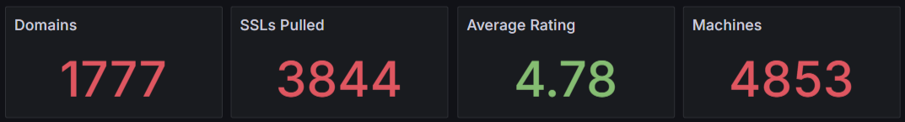

# Deployrr

> Transform your homelab setup from complex to click! Deployrr is your all-in-one solution for automated Docker-based homelab deployment.

[](APPS.md)

## What is Deployrr?

Deployrr revolutionizes homelab setup by automating the deployment and configuration of Docker and Docker Compose environments. Whether you're a homelab enthusiast or a professional sysadmin, Deployrr streamlines the process of setting up and managing your containerized applications.

### Key Features

- **Extensive App Support**: 150+ pre-configured applications ready for deployment
- **Intelligent Automation**: Automated environment setup with smart system checks
- **Enterprise-Grade Security**:
  - Socket-Proxy protection
  - CrowdSec integration
  - Multiple authentication options (Authentik, Authelia, TinyAuth, Google OAuth)
- **Professional Networking**:
  - Advanced Traefik reverse proxy configuration
  - Flexible exposure modes (Internal, External, or Hybrid)
  - Multi-server and multi-domain support
- **AI & Automation Stacks**: Curated app bundles for self-hosted AI (Ollama, Open-WebUI, Flowise) and automation (n8n, Node-RED)
- **Smart Management**:
  - Intuitive stack management interface
  - Automated backup and restoration
  - Comprehensive monitoring and logging
  - Remote share mounting (SMB, NFS, Rclone)

## Prerequisites

Deployrr v6 requires `curl` and `npm` (Node.js) to be installed on your system before beginning the installation.

**For Ubuntu / Debian:**
```bash
sudo apt update && sudo apt upgrade -y
sudo apt install -y curl npm
```

**For CentOS / RHEL / Rocky Linux:**
```bash
sudo dnf update -y
sudo dnf install -y curl npm
```

**For Arch Linux:**
```bash
sudo pacman -Syu --noconfirm
sudo pacman -S --noconfirm curl npm
```

## Quick Start

The fastest way to install Deployrr v6+ is via `npx` (requires Node.js/npm):
```bash
sudo npx @simplehomelab/deployrr
```

Alternatively, if you prefer not to use `npm`, you can use the standalone bash installer:
```bash
sudo bash -c "$(curl -fsSL https://files.deployrr.app/install.sh)"
```

> **Note for v5 Users:** The older installation command (`curl https://www.deployrr.app/install.sh`) is deprecated and is strictly for initializing Deployrr v5 environments.

## Impact & Growth


## Testimonials

> I went from skeptic to fully believing (and knowing) and its the homelab deal of the century - David S

> With Deployrr I was able to cleanly setup everything in a matter of hours. I'm still new to the platform but so far it's delivered everything I hoped it would - Tim Bishop

[Check Out All Testimonials](https://www.simplehomelab.com/testimonials/)

# Supported Apps
Deployrr can automatically setup Socket Proxy, Traefik (fetch LE SSL certificates), Authentik, Authelia, TinyAuth, Portainer, Plex, Jellyfin, Starr Apps, Gluetun, Dozzle, Uptime-Kuma, Homepage, CrowdSec, and other apps. 

[Full List of Apps](APPS.md)

## Learn More

- [Official Documentation](https://www.simplehomelab.com/deployrr/)
- [Quick Start Guide (20 min)](https://www.simplehomelab.com/go/deployarr-v5-intro/)
- [Comprehensive 2.5-hour Tutorial](https://www.simplehomelab.com/go/deployarr-v5-detailed-guide/)

## Supported Environments

- **Primary Platform**: Ubuntu and Debian-based systems
- **Secondary Platform** (working but unsupported): Arch, CentOS/RHEL/Rocky
- **Deployment Options**: Baremetal, VM, Windows WSL, and LXC environments

## License Options

Deployrr offers flexible licensing to suit different needs:

- **Free Tier**: Essential features for basic setups
- **Paid Tiers**: 
  - Basic
  - Plus
  - Pro
  
[View Detailed Comparison](https://www.simplehomelab.com/deployrr/pricing/)

Note: Annual [website memberships](https://www.simplehomelab.com/membership-account/join-the-geek-army/) include full Deployrr access!

## Support & Community

Join our thriving community:
- [Deployrr Docs](https://docs.deployrr.app) - Answers to many common questions, fixes for issues, and improvement ideas
- [Discord Community](https://www.simplehomelab.com/discord/) - Get help and share experiences
- [YouTube Channel](https://www.youtube.com/@Simple-Homelab) - Tutorial videos and updates

## Project Vision

Deployrr isn't just another container manager - it's your pathway to homelab mastery. My goal with Deployrr is to:
- Simplify complex deployments
- Enable rapid testing, experimentation, and learning
- Foster learning through hands-on experience
- Provide quick recovery options when needed

## Feature Showcase


<details>
<summary>Click to view screenshots</summary>

#### Dashboard & Management


#### Setup & Configuration


[View More Screenshots](#screenshots)
</details>

## Known Limitations

- DNS Challenge Provider: Currently Cloudflare-only
- Port forwarding requirements: 80/443
- Specific database-dependent apps may require manual database removal

## Contributing to Open Source

Part of Deployrr's revenue supports open-source projects through [OpenCollective](https://opencollective.com/deployrr).

---

<div align="center">

**Transform your homelab journey with Deployrr**

[Get Started](https://www.simplehomelab.com/deployrr/) | [Join Discord](https://www.simplehomelab.com/discord/) | [Watch Tutorial](https://www.simplehomelab.com/go/deployarr-v5-intro/)

</div>

